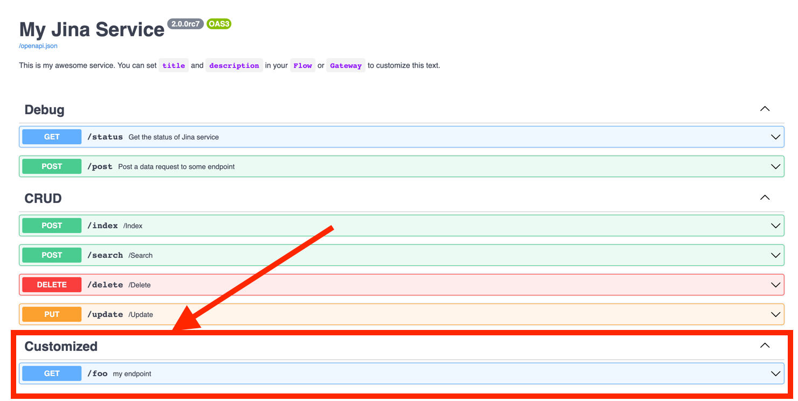
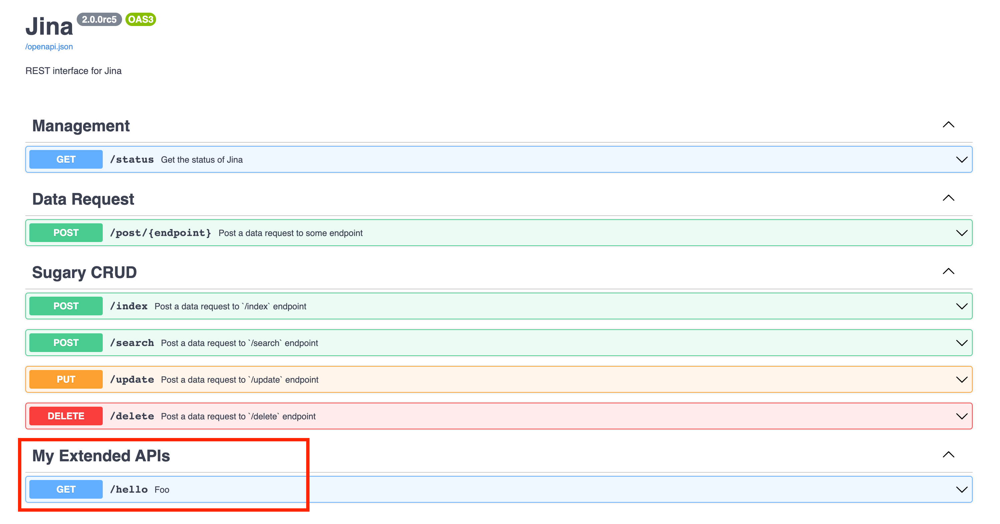

# Cookbook on Serving Jina

Congrats! If you come to this page, most likely you have already built some cool stuff with Jina and now want to share it to the world. This cookbook will
guide you from basic serving for demo purpose to advanced serving in production.


<!-- START doctoc generated TOC please keep comment here to allow auto update -->
<!-- DON'T EDIT THIS SECTION, INSTEAD RE-RUN doctoc TO UPDATE -->
Table of Contents

* [Flow-as-a-service](#flow-as-a-service)
    + [Supported Communication Protocols](#supported-communication-protocols)
    + [Python Client with gRPC Request](#python-client-with-grpc-request)
    + [Python Client with WebSocket Protocol](#python-client-with-websocket-protocol)
    + [Enable HTTP Access](#enable-http-access)
    + [`curl` with HTTP Request](#-curl--with-http-request)
    + [Enable Cross-origin-resources-sharing (CORS)](#enable-cross-origin-resources-sharing--cors-)
    + [Extend HTTP Interface](#extend-http-interface)

<!-- END doctoc generated TOC please keep comment here to allow auto update -->

## Flow-as-a-service

Flow is how Jina streamlines and scales Executors, and you can serve it as a service.

More precisely, a `Flow` _is_ a service by nature. Though implicit, you are already using it as a service.

When you start a `Flow` and call `.post()` inside the context, a `jina.Client` object is started and used for
communication.


Many times we need to use `Flow` & `Client` in a more explicit way, often due to one of the following reasons:

- `Flow` and `Client` are on different machines: one on GPU, one on CPU;
- `Flow` and `Client` have different lifetime: one lives longer, one lives shorter;
- Multiple `Client` want to access one `Flow`;
- One `Client` want to interleave its access to multiple `Flow`;
- `Client` is browser/curl/Postman.

Before this cookbook, you are mostly using Flow as an implicit service. In the sequel, we will show you how to serve
Flow in an explicit C/S style.

### Supported Communication Protocols

Jina supports `grpc`, `websocket`, `http` three communication protocols between `Flow` and `Client`.

| Protocol | Description | Performance |
| --- | --- | --- |
| `grpc` | Default protocol, mainly for streaming data | Super |
| `websocket` | WebSocket protocol, used in frontend language that supports websocket, mainly for streaming data | Super |
| `http` | HTTP protocol, mainly for allow any client to have RESTful access | Good |

The protocol is controlled by `Flow(protocol='grpc')`, e.g.

```python
from jina import Flow

f = Flow(protocol='websocket', port_expose=12345)
with f:
    f.block()
```

This will serve the Flow with WebSocket, so any Client connects to it should follow the WebSocket protocol as well.

```python
from jina import Client

c = Client(protocol='websocket', port_expose=12345)
c.post(...)
```

### Python Client with gRPC Request

On the server-side, create an empty Flow and use `.block` to prevent the process exiting.

```python
from jina import Flow

with Flow(port_expose=12345) as f:
    f.block()
```

```text
        gateway@27251[I]:starting jina.peapods.runtimes.asyncio.grpc.GRPCRuntime...
        gateway@27251[I]:input tcp://0.0.0.0:58106 (PULL_CONNECT) output tcp://0.0.0.0:58106 (PUSH_BIND) control over ipc:///var/folders/89/wxpq1yjn44g26_kcbylqkcb40000gn/T/tmp0ygqijgx (PAIR_BIND)
        gateway@27251[S]:GRPCRuntime is listening at: 0.0.0.0:12345
        gateway@27247[S]:ready and listening
           Flow@27247[I]:1 Pods (i.e. 1 Peas) are running in this Flow
           Flow@27247[S]:🎉 Flow is ready to use, accepting gRPC request
           Flow@27247[I]:
	🖥️ Local access:	tcp://0.0.0.0:12345
	🔒 Private network:	tcp://192.168.1.14:12345
```

Note that the host address is `192.168.1.14` and `port_expose` is `12345`.

While keep this server open, let's create a client on a different machine:

```python
from jina import Client

c = Client(host='192.168.1.14', port_expose=12345)

c.post('/')
```

```text
         GRPCClient@27219[S]:connected to the gateway at 192.168.1.14:12345!
  |█                   | 📃    100 ⏱️ 0.0s 🐎 26690.1/s      1   requests takes 0 seconds (0.00s)
	✅ done in ⏱ 0 seconds 🐎 24854.8/s
```

### Python Client with WebSocket Protocol

Server side:

```python
from jina import Flow

with Flow(port_expose=12345, protocol='websocket') as f:
    f.block()
```

Client side:

```python
from jina import Client

c = Client(host='192.168.1.14', port_expose=12345, protocol='websocket')
c.post('/')
```

```text
         WebSocketClient@27622[S]:Connected to the gateway at 192.168.1.14:12345
  |█                   | 📃    100 ⏱️ 0.0s 🐎 19476.6/s      1   requests takes 0 seconds (0.00s)
	✅ done in ⏱ 0 seconds 🐎 18578.9/s
```

### Enable HTTP Access

To enable a Flow to receive from HTTP requests, you can add `protocol='http'` in the Flow constructor.

```python
from jina import Flow

f = Flow(protocol='http').add(...)

with f:
    f.block()
```

You can switch to other protocol also via `.protocol` setter. Switching back to gRPC can be done
via `f.protocol = 'grpc'`.

Note, unlike 1.x these two functions can be used **inside the `with` context after the Flow has started**:

```python
from jina import Flow, Document

f = Flow()  # protocol = grpc 

with f:
    f.post('/index', Document())  # indexing data

    f.protocol = 'http'  # switch to HTTP protocol request
    f.block()
```

You will see console prints logs as follows:

```console
           JINA@4262[I]:input tcp://0.0.0.0:53894 (PULL_CONNECT) output tcp://0.0.0.0:53894 (PUSH_BIND) control over ipc:///var/folders/89/wxpq1yjn44g26_kcbylqkcb40000gn/T/tmp4e9u2pdn (PAIR_BIND)
           JINA@4262[I]:
    Jina REST interface
    💬 Swagger UI:	http://localhost:53895/docs
    📚 Redoc     :	http://localhost:53895/redoc
        
           JINA@4262[S]:ready and listening
        gateway@4262[S]:HTTPRuntime is listening at: 0.0.0.0:53895
        gateway@4251[S]:ready and listening
```

You can navigate to the Swagger docs UI via `http://localhost:53895/docs`:


### `curl` with HTTP Request

Now you can send data request via `curl`/Postman:

```console
$ curl --request POST -d '{"data": [{"text": "hello world"}]}' -H 'Content-Type: application/json' http://localhost:53895/post/index

{
  "request_id": "1f52dae0-93a5-47b5-9fa0-522a75301d99",
  "data": {
    "docs": [
      {
        "id": "28287a66-b86a-11eb-99c2-1e008a366d49",
        "tags": {},
        "text": "hello world",
        "content_hash": "",
        "granularity": 0,
        "adjacency": 0,
        "parent_id": "",
        "chunks": [],
        "weight": 0.0,
        "siblings": 0,
        "matches": [],
        "mime_type": "",
        "location": [],
        "offset": 0,
        "modality": "",
      }
    ],
    "groundtruths": []
  },
  "header": {
    "exec_endpoint": "index",
    "target_peapod": "",
    "no_propagate": false
  },
  "routes": [
    {
      "pod": "gateway",
      "pod_id": "5e4211d0-3916-4f33-8b9e-eec54be8ed9a",
      "start_time": "2021-05-19T06:19:24.472050Z",
      "end_time": "2021-05-19T06:19:24.473895Z"
    },
    {
      "pod": "gateway",
      "pod_id": "83a7ad34-1042-4b5d-b065-3692e2fc691b",
      "start_time": "2021-05-19T06:19:24.473831Z"
    }
  ],
  "status": {
    "code": "SUCCESS",
    "description": ""
  }
}
```

When use `curl`, make sure to pass the `-N/--no-buffer` flag.

### Enable Cross-origin-resources-sharing (CORS)

CORS is by default disabled for security. That means you can not access the service from a webpage with different domain. To override this, simply do:

```python
from jina import Flow

f = Flow(cors=True, protocol='http')
```

### Extend HTTP Interface

#### Expose Executor Endpoints to HTTP Interface

`Flow.expose_endpoint` can be used to expose executor's endpoint to HTTP interface, e.g.

```python
from jina import Executor, requests, Flow

class MyExec(Executor):

    @requests(on='/foo')
    def foo(self, docs, **kwargs):
        pass

f = Flow(protocol='http').add(uses=MyExec)
f.expose_endpoint('/foo', summary='my endpoint')
with f:
    f.block()
```



You can add more kwargs to build richer semantics on your HTTP endpoint. Those meta information will be rendered by SwaggerUI and be forwarded to the generated OpenAPI schema.

#### Hide CRUD and Debug Endpoints from HTTP Interface

User can decide to hide CRUD and debug endpoints in production, or when the context is not applicable. For example, in the code snippet above, we didn't implment any CRUD executors' endpoints, hence it does not make sense to expose them to public.

```python
from jina import Flow
f = Flow(protocol='http', no_debug_endpoints=True, no_crud_endpoints=True)
```


#### Add non-Jina Related Routes

If you want to add more customized routes, configs, options to HTTP interface, you can simply
override `jina.helper.extend_rest_interface` function as follows:

```python
import jina.helper
from jina import Flow


def extend_rest_function(app):
    @app.get('/hello', tags=['My Extended APIs'])
    async def foo():
        return 'hello'

    return app


jina.helper.extend_rest_interface = extend_rest_function
f = Flow(protocl='http')

with f:
    f.block()
```

And you will see `/hello` is now available:


